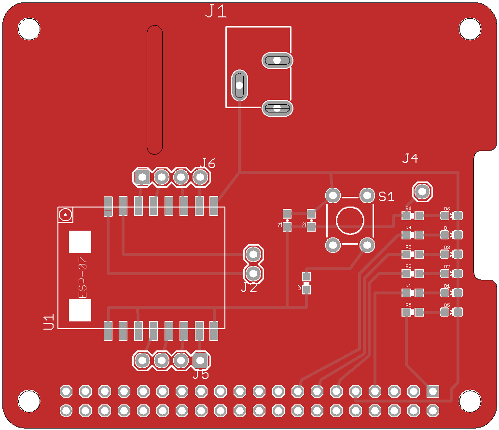

# electronics-rpi-control
Control Hat for the Raspberry Pi

This is a simple Hat that enables wireless control of the Raspberry Pi.

Main features:
- Wireless control using ESP8266-07 module
- 5v input voltage from external socket 
- 5v and 3v3 power led indicators
- Four general purpose leds
- Easy access to ESP8266-07 GPIOs 
- ESP8266-07 programming button
